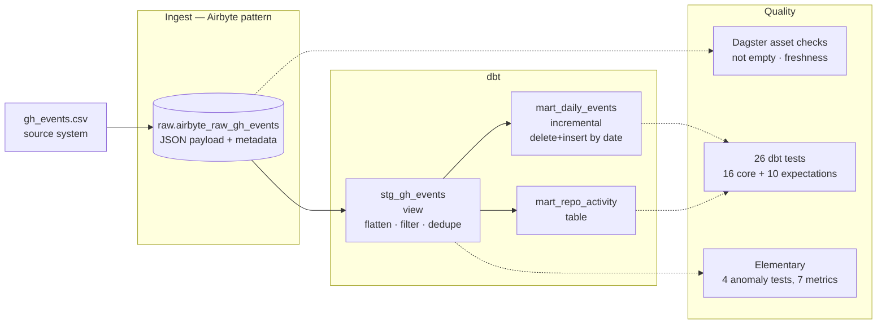
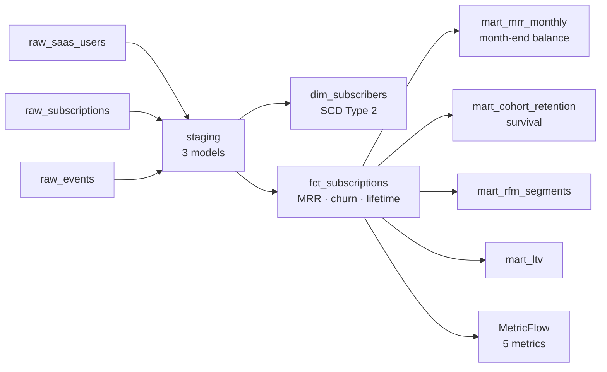
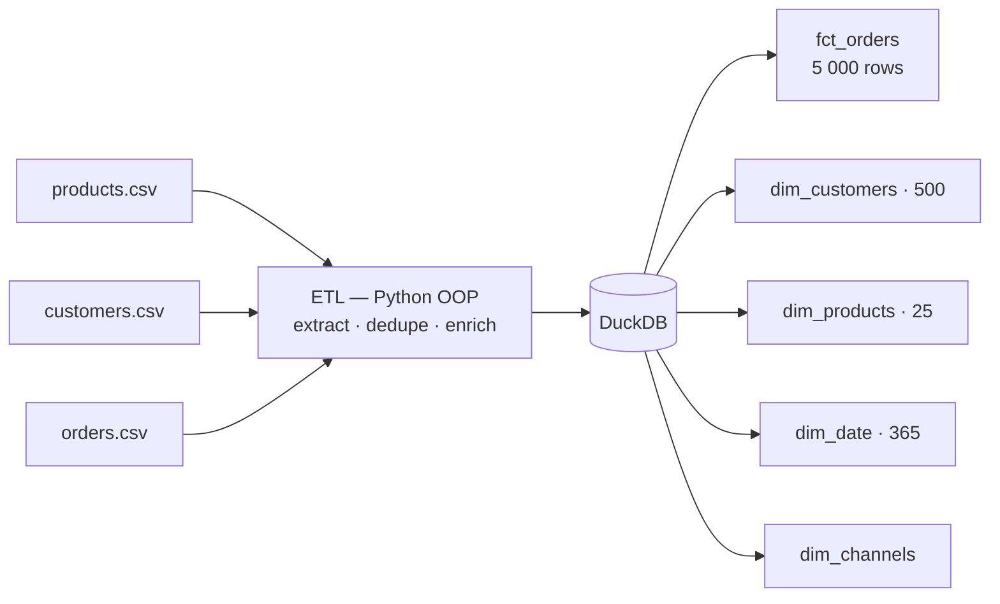

# Analytics Engineer Portfolio — Diyar Mahmudov

Junior Analytics Engineer, Bishkek (UTC+6). Six projects built over 96 days of
deliberate practice: **SQL · dbt · Snowflake · Dagster · Airbyte · DuckDB**.

Looking for an internship or part-time role, remote.

**[Live dashboard](https://seinokojii.github.io/analytics-engineer-roadmap/)** ·
[dbt docs — lineage & catalog](https://seinokojii.github.io/analytics-engineer-roadmap/dbt/) ·
[CV — PDF, EN & RU](https://seinokojii.github.io/analytics-engineer-roadmap/cv/) ·
[Production pipeline docs](docs/PRODUCTION_PIPELINE.md) ·
[dbt CI](https://github.com/Seinokojii/analytics-engineer-roadmap/actions/workflows/dbt_ci.yml)

[](https://github.com/Seinokojii/analytics-engineer-roadmap/actions/workflows/dbt_ci.yml)

---

## The one project to read first

### Production Pipeline — Airbyte pattern → dbt → Dagster → quality gate

An end-to-end pipeline that is reproducible from a clean checkout. Not "I can
write dbt models" but "I can make a pipeline fail loudly and rebuild itself on
someone else's machine".



| | |
|---|---|
| **Stack** | Dagster · dbt Core · DuckDB (Snowflake by changing a target) · Elementary |
| **Scale** | 3 daily partitions, 227 events, 3 dbt models |
| **Tests** | 30 across three layers — `dbt build` PASS=35, ERROR=0 |
| **CI** | 2 jobs per pull request, both green on PR #1 (parse 39s, build 1m) |
| **Docs** | `dbt docs` with 25/25 columns described; Dagster asset catalog |
| **Run it** | `docker compose up` → Dagster on `:3000` |

The test suite is verified *negatively*: a script corrupts the raw table on
purpose, asserts the tests go red, then restores the database. A test suite
that has never failed is an unverified test suite.

→ **[Full documentation, quick start, and the Snowflake migration path](docs/PRODUCTION_PIPELINE.md)**
· code in [`production_pipeline/`](production_pipeline/) and [`dbt_analytics/`](dbt_analytics/)

**What I would improve:** ingestion reads one source through the Airbyte
*pattern* rather than a running Airbyte instance — the three real connectors
live in [`airbyte_setup/`](airbyte_setup/) but are not wired into the Dagster
graph. Backfill is proven by re-running partitions from code; I have not driven
it from the Dagster UI.

---

## SaaS Subscriptions — retention, churn, cohorts

A subscription analytics stack over the dbt seeds: 500 users, 500 subscriptions,
9 models across staging and marts, an SCD Type 2 snapshot, a MetricFlow semantic
layer, and a dashboard that shows where every number came from.

**[→ Open the dashboard](https://seinokojii.github.io/analytics-engineer-roadmap/)**
— MRR as a month-end balance, cohort survival, churn by plan and by channel, LTV,
RFM. Filters recompute the charts from rows, every figure expands to its SQL, and
two panels sit under the charts: a lineage graph down to the model, and the
results of the latest `dbt build` read from Elementary's own tables.



### Two defects, and neither was in the chart

**One in my own model.** `mart_cohort_retention` measured `month_num` from the
subscription's own `start_date`, so every cohort produced exactly one row —
month 0 at 100 % — and the retention "curve" was a flat line that looked
perfectly healthy. A `not_null` test on the column passed the whole time,
because the column was never null; it was just never anything else either.
Rewritten as a survival curve and guarded by a singular test that fails if
retention ever rises inside a cohort:

```sql
-- tests/assert_retention_monotonic.sql — rows returned = test failure
with r as (
    select cohort_month, month_num, retention_pct,
           lag(retention_pct) over (partition by cohort_month order by month_num) as prev_pct
    from {{ ref('mart_cohort_retention') }}
)
select * from r where prev_pct is not null and retention_pct > prev_pct
```

**One in the data.** The exploratory dataset from `monthly_project2.py` — 800
subscriptions — generates subscription `start_date` independently of user
`signup_date`, so recomputing cohorts there gives retention that *grows*:
11 → 32 → 51 → 71 users in the January cohort, which is impossible. Cohort
retention and survival-based LTV cannot be computed from it at all, and the
shipped `cohort_analysis` table hid this behind rows with a negative "months
since signup". That dataset is not what the dashboard reads; the dbt seeds are,
and there `start_date >= signup_date` holds in all 500 rows.

**What I would improve:** give the generator a rising churn hazard instead of a
uniform one, add `start_date >= signup_date` as a source test — one rule would
have caught the second defect on the first run — and make `mart_mrr_monthly`
incremental by month rather than rebuilding all 21.

→ code in [`dbt_analytics/models/`](dbt_analytics/models/) · dashboard in
[`docs/`](docs/)

---

## E-commerce Data Warehouse — star schema from raw CSV

Python OOP ETL → DuckDB warehouse → dbt models → KPI dashboard. Built on a
deliberately dirty dataset: 100 duplicate orders, 5% NULLs in `channel` and
`payment`, and foreign keys pointing outside the product dimension.



| | |
|---|---|
| **Model** | Star schema — 1 fact, 4 dimensions |
| **Volume** | 5 000 orders, 500 customers, 365 days |
| **Quality** | Deduplication, NULL policy per column, referential checks |
| **Output** | Two matplotlib dashboards, KPI report |

**What I would improve:** 3 748 of 5 000 orders carry a zero price because
`product_id` in the source ranges beyond the 25 products in the dimension, so
the merge produces NULLs that the ETL fills with zero. Filling with zero was
the wrong call — those rows should be quarantined into a reject table and
counted, not silently averaged into revenue. That is why this project's
numbers are not on the dashboard.

→ code in [`project/`](project/)

---

## Three focused builds

| Project | What it demonstrates | Code |
|---|---|---|
| **Data contracts** | Schema contracts as YAML with enforced types and constraints; a breaking change fails CI before merge | [`contracts/`](contracts/) |
| **Semantic layer** | 5 MetricFlow metrics defined once, queried consistently; a metrics API over them | [`dbt_analytics/metrics/`](dbt_analytics/metrics/) · [`metrics_api/`](metrics_api/) |
| **Snowflake architecture** | RBAC, stages, `COPY INTO`, Streams, Tasks, Time Travel, zero-copy clone — 14 SQL scripts | [`snowflake_setup/`](snowflake_setup/) |

**Honest limitation on the Snowflake work:** the scripts are written against
real Snowflake syntax but have not been executed on a Snowflake account — the
mechanics were reproduced locally in DuckDB (a `valid_from`/`valid_to` history
table for Time Travel, an offset-and-hash diff for Streams). `UNDROP` and
Fail-safe cannot be simulated locally, and I say so rather than implying
production experience.

---

## Evidence, not claims

Every claim above has something to click.

| Claim | Where to check it |
|---|---|
| Tests exist and are green | [Quality panel on the dashboard](https://seinokojii.github.io/analytics-engineer-roadmap/#s-quality) — read from Elementary's tables, with the run date |
| The models are wired the way I say | [dbt docs lineage graph](https://seinokojii.github.io/analytics-engineer-roadmap/dbt/) and the lineage panel on the dashboard |
| CI actually runs on pull requests | [Workflow runs](https://github.com/Seinokojii/analytics-engineer-roadmap/actions/workflows/dbt_ci.yml) |
| The test suite has failed at least once | [`lesson86_88.py`](lesson86_88.py), `step9_negative_test()` — corrupts the raw table on purpose, asserts the tests go red, restores the database |
| The dashboard numbers match the marts | [`docs/test_build_dashboard.py`](docs/test_build_dashboard.py) recomputes month-end MRR from rows and compares against `mart_mrr_monthly` |

---

## Stack

| | |
|---|---|
| **Languages** | SQL (advanced), Python (pandas, Polars, requests, OOP) |
| **Transformation** | dbt Core — models, tests, macros, snapshots, incremental, packages, semantic layer |
| **Warehouse** | Snowflake (scripts), PostgreSQL, DuckDB |
| **Orchestration** | Dagster — assets, schedules, sensors, partitions, backfill, asset checks |
| **Ingestion** | Airbyte self-hosted, 3 connectors |
| **Quality & CI** | dbt tests, dbt-expectations, Elementary, data contracts, GitHub Actions |
| **BI** | Metabase, Lightdash, matplotlib |

---

## Repository layout

| Path | Contents |
|---|---|
| `production_pipeline/` | Dagster assets, checks, schedule |
| `dbt_analytics/` | dbt models, tests, macros, metrics |
| `project/` | E-commerce warehouse + ETL |
| `contracts/` | Data contracts |
| `snowflake_setup/` | Snowflake SQL scripts |
| `airbyte_setup/` | Connector configuration |
| `docs/` | Dashboard (`index.html`, `build_dashboard.py`), pipeline documentation, demo script |
| `docs/dbt/` | Published dbt docs — model catalog and lineage graph |
| `docs/cv/` | CV in English and Russian, PDF |
| `lesson*.py` | Daily exercises, days 1–96 |

<details>
<summary>About the lesson files</summary>

This repository doubles as a 180-day Analytics Engineer study roadmap. The
`lesson*.py` files are daily exercises; the projects above are what they build
up to. They are kept in the open on purpose — the working notes are part of the
evidence.

</details>
