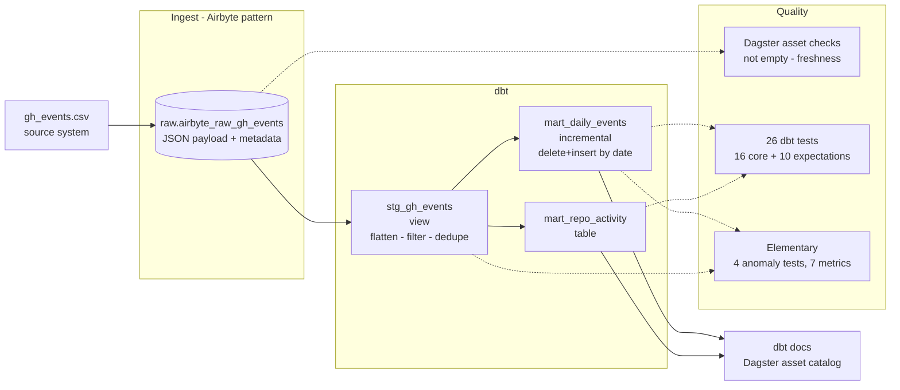

# Production Analytics Pipeline — full documentation

[](https://github.com/Seinokojii/analytics-engineer-roadmap/actions/workflows/dbt_ci.yml)

An end-to-end analytics pipeline: ingestion, warehouse modelling,
orchestration and three layers of data quality checks - all reproducible
from a clean checkout.

Built on **dbt + Dagster + DuckDB** locally, designed to move to
**Snowflake** by changing a target in `profiles.yml`.

---

## Architecture



Dagster orchestrates the whole graph. The ingest asset is partitioned by day,
so a backfill re-runs one partition at a time and every re-run is idempotent.

---

## Quick start

Requires Python 3.12. Python 3.14 is **not** supported - dbt's dependencies
break on it.

```bash
python -m venv .venv
source .venv/bin/activate       # Linux / macOS
.venv\Scripts\activate         # Windows
pip install -r requirements.txt

python lesson81_85.py           # load data, run the pipeline end to end
python lesson86_88.py           # tests, monitoring, CI, Docker
python lesson89_90.py           # documentation
```

Dagster UI:

```bash
cd production_pipeline
dagster dev -f definitions.py   # http://localhost:3000
```

Model documentation:

```bash
cd dbt_analytics
dbt docs generate && dbt docs serve --port 8080
```

dbt only:

```bash
cd dbt_analytics
dbt build --select tag:production_pipeline
dbt source freshness --select source:gh_raw
```

Docker:

```bash
docker compose up               # Dagster on :3000
docker compose --profile docs up dbt-docs
```

---

## Data quality

30 tests run on every build, in three layers, each catching what the others
miss:

| Layer | Answers | Example |
|---|---|---|
| dbt core tests | Is this row valid? | `unique`, `not_null`, `accepted_values` |
| dbt-expectations | Is this value plausible? | row count > 0, payload size in range |
| Elementary | Does today look like yesterday? | volume drop, mean shift, null spike |
| Dagster asset checks | Should downstream even run? | raw not empty, source fresh < 26h |

The suite is verified negatively: `lesson86_88.py` step 9 corrupts the raw
table on purpose, asserts the tests go red, then restores the database.
A test suite that has never failed is an unverified test suite.

---

## CI

`.github/workflows/dbt_ci.yml` runs on every pull request:

1. **parse + compile** - catches broken Jinja and bad `ref()` without touching
   data. Fails in under a minute.
2. **build + test** - rebuilds the warehouse from CSV on a clean DuckDB file
   and runs the full test suite.

The database is gitignored, so CI reconstructs `raw` using the same
`ingest_core.sync_partition` the Dagster asset calls. One ingestion code path
for local, CI and production - a difference there is how green CI hides a
broken pipeline.

---

## Moving to Snowflake

The warehouse is swappable by design:

1. Point a `prod` target at Snowflake in `profiles.yml`
2. Put credentials in GitHub Secrets (`SNOWFLAKE_ACCOUNT`, `_USER`, ...)
3. Uncomment the `dbt-snowflake` job in `dbt_ci.yml`
4. Delete `macros/duckdb_elementary_shims.sql` - it exists only because
   Elementary ships no DuckDB implementation of `edr_multi_value_in`

Model SQL needs one change: DuckDB's `json_extract_string(col, '$.field')`
becomes Snowflake's `col:field::TYPE`.

---

## Layout

| Path | Contents |
|---|---|
| `production_pipeline/` | Dagster assets, checks, schedule |
| `dbt_analytics/` | dbt models, tests, macros |
| `.github/workflows/` | CI |
| `reports/` | Generated run reports |
| `docs/` | Demo script |

---

<details>
<summary>About this repository</summary>

This is a 180-day Analytics Engineer study roadmap. The `lesson*.py` files are
daily exercises; the pipeline above is the production artifact they build up
to. Progress is tracked outside the repo.

</details>
